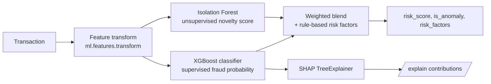
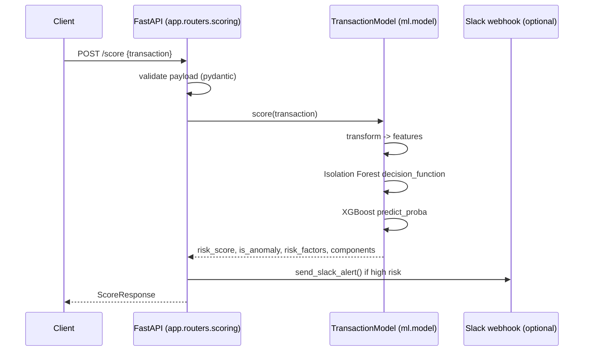

# Architecture

FraudPulse scores payment transactions in real time using two complementary
models, then explains the result and optionally raises an alert. This
document describes how the pieces fit together and why.

## Why two models?

Real fraud platforms rarely rely on a single model:

- A **supervised classifier** is precise for fraud patterns it has already
  seen labeled examples of, but blind to genuinely novel behavior.
- An **unsupervised anomaly detector** catches statistically unusual
  transactions even without labeled examples, but is noisier and can't
  distinguish "unusual" from "fraudulent."

FraudPulse combines both so a transaction can be flagged either because it
resembles known fraud, or because it simply looks nothing like normal
traffic:



`risk_score = 0.45 * anomaly_score + 0.55 * fraud_probability`, clipped to
`[0, 1]`. Weights live in `ml.model.ANOMALY_WEIGHT` /
`FRAUD_PROBABILITY_WEIGHT`. A small set of interpretable rules (amount
threshold, merchant/country risk, unusual hour) run alongside the models and
are surfaced as `risk_factors` - useful both as a sanity check on the ML
output and as a fallback explanation channel that doesn't depend on SHAP.

## Request lifecycle



## Training vs. serving

Training and serving share the exact same feature transform
(`ml.features.transform`) to avoid train/serve skew - a common source of bugs
in real ML systems. `ml.train` fits both models on synthetic data
(`ml.data`) and persists a single `TransactionModel` (pipeline + classifier +
metadata) to `models/fraud_model.joblib` with `joblib`. `ml.model.load_or_train()`
loads that artifact at process startup, and transparently falls back to
training on the fly if it's missing or unreadable - so a fresh clone works
with zero setup, while the Docker image bakes the artifact in at build time
for fast, reproducible container startup.

## Why synthetic data?

FraudPulse ships without access to real payment data, so every model is
trained on synthetic transactions generated in `ml.data`:

- `generate_feature_frame` - unlabeled samples for the Isolation Forest.
- `generate_labeled_dataset` - labeled samples for the XGBoost classifier,
  where labels come from a *noisy weighted combination* of risk signals
  (amount, merchant risk, country risk, unusual hour) rather than hard
  rules. This forces the classifier to learn a soft decision boundary
  instead of just memorizing the same rules already implemented in
  `risk_factors`.

This keeps the project runnable and testable without any external data or
credentials, while still exercising a realistic training pipeline. Swapping
in real historical transactions means replacing `ml.data` and re-running
`ml.train` - the API, explainability, and serving code do not need to change.

## Layers

```text
app/            FastAPI web layer: HTTP routing, request/response schemas,
                auth, CORS, alerting, the bundled test dashboard.
ml/             Model layer: feature engineering, synthetic data, training,
                persistence, scoring, SHAP explanations.
scripts/        Operator/demo utilities that talk to a running API.
tests/          Unit tests (ml) and integration tests (app), mirrored 1:1
                with the source layout.
```

`app` depends on `ml`; `ml` never imports from `app`. This keeps the model
code reusable outside of the web service (e.g. in a batch/offline scoring
job or a notebook) without pulling in FastAPI.

## Security & production considerations

This is a demonstration project. Before using it with real payment data:

- **Authentication**: `API_KEY` enables a simple shared-secret header; swap
  for OAuth2/mTLS/service identity in production.
- **CORS**: defaults to `*` for easy local testing; set `CORS_ORIGINS` to an
  explicit allowlist.
- **Rate limiting**: not implemented; add at the gateway/load balancer or
  with a library like `slowapi`.
- **Persistence**: transactions and scores are not stored; add an audit log
  / data warehouse sink for compliance and model monitoring.
- **Model governance**: `GET /model/info` exposes basic metadata; a
  production system would track this in a model registry (e.g. MLflow)
  with full lineage back to training data and code version.
- **Data**: replace `ml.data`'s synthetic generators with a real, versioned
  training dataset before trusting the model's decisions.
